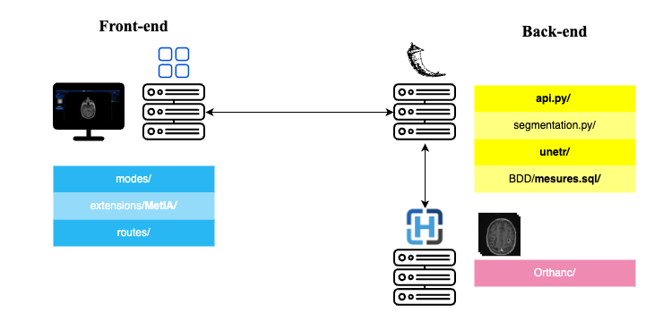
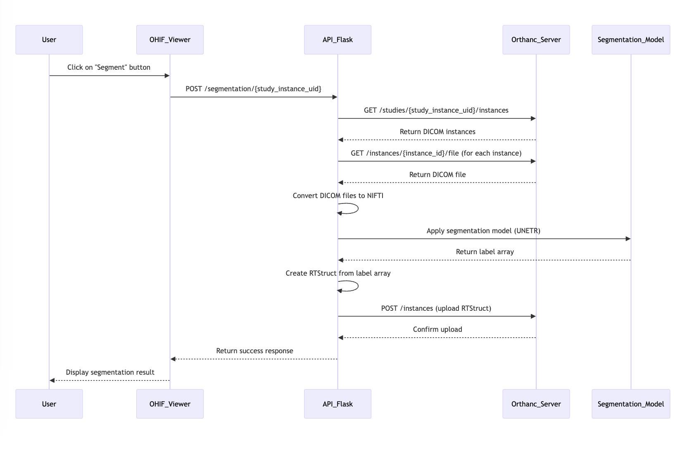

# Welcome to the SegmentationUI Back-end Project

This project aims to enable the OHIF Viewer interface to launch a deep learning algorithm designed to detect brain metastases, based on the UNETR architecture. This part of the project serves as an API to communicate between the Orthanc DICOM Web Server for retrieving/managing medical data in DICOM format and the fine-tuned UNETR deep learning model for brain metastasis segmentation.

## Important

This project is divided into two parts:
- The back-end part (this repository)
- The front-end part is accessible [here](https://github.com/VendenIX/BrainMetaSegmentatorUI-Front).

## Configuration Prerequisites to Run the Model on the Repository

| Resource               | Requirement                                             |
|------------------------|----------------------------------------------------------|
| RAM                    | 8GB VRAM                                                 |
| GPU                    | RTX 3050 Cuda                                            |

## Architecture 



### Front-end

The front-end of the project is responsible for the user interface and interaction. The primary code for the MetIA functionality is located in the `extensions/MetIA/` directory. The structure is as follows:

- `modes/` - Contains the different modes of the application.
- `extensions/MetIA/` - Houses the main code for the MetIA functionalities.
- `routes/` - Manages the routes for the front-end components.

### Back-end

The back-end handles the processing, database management, and integration with external tools. The main back-end components include:

- `api.py` - Contains the main code along with all the routes for the back-end services.
- `segmentation.py` - This code is responsible for launching the model.
- `unetr/` - This directory contains the code for the UNETR model.
- `BDD/mesures.sql/` - Stores the database and SQL scripts for the tracking.
- `Orthanc/` - All code related to Orthanc, a DICOM Web server, is located in this directory.

## A Sequence Diagram of a Segmentation Request



## To Install the Pre-trained Weights (required to run the deep model):

[Download the pre-trained weights](https://drive.google.com/file/d/1kR5QuRAuooYcTNLMnMj80Z9IgSs8jtLO/view)

Place this 300 MB file in **unetr/pretrained_models/**

## Install the Libraries:
/!\ Use a new environnement with python 3.9
```
conda create --name=IRM-Project python=3.9
conda activate IRM-Project
```

```bash
pip install -r requirements.txt
```
If you encounter difficulties installing, try installing the libraries incrementally. Special mention for installing PyTorch:
```bash
pip3 install torch torchvision torchaudio --index-url https://download.pytorch.org/whl/cu111
```

# Launch the Back-end in Development Mode:
## Start the Orthanc DICOM Web Server and nginx proxy:

Create a network named 'pacs' with Docker if it hasn't been created:
```bash
docker network create pacs
```

Then, start the Docker stack by navigating to the root of the repository:
```bash
docker-compose -f Orthanc/docker-compose.yml up -d
```

## Start the Flask API:
To start the API:
```bash
python3 api.py
```

# Launch the Back-end in Production Mode:
## For Windows:
Ensure that the front-end and back-end repositories are in the same directory:
```bash
git checkout deploiementWindows
```

Specify the path of the UNETR model weights in the `.env` file.
Example:
```env
MODEL_PATH='./models/checkpoint_epoch1599_val_loss0255.cpkt'
```

Execute the `start_services.bat` file:
```bash
# You can create a shortcut on your desktop or make it executable
```

Install your DICOM Web Server Orthanc here : https://www.orthanc-server.com/download-windows.php 

Adapt the path of the environnemnt in the start_services.bat file line 33 (only the path of the activate.bat file and the name of the environnment)

## If You Want to Quickly Delete Medical Data from Your Local Orthanc Server
Clean-up:
```bash
rm -rf ./Orthanc/orthanc-db/*
```

Alternatively, you can delete everything cleanly using the administration interface available at localhost:8042, or via OHIF on the front-end.

## If a Password Is Required, Use the Following:
Login: mapdr
Password: changestrongpassword

## To Shut Down the DICOM Web Server, Use the Following Command:
```bash
docker-compose -f Orthanc/docker-compose.yml down
```

And optionally, if you want to remove the pacs network:
```bash
docker network rm pacs # if you want to remove the network
```


## References

```bibtex
@article{DESSOUDE2025121002,
title = {Development and routine implementation of deep learning algorithm for automatic brain metastases segmentation on MRI for RANO-BM criteria follow-up},
journal = {NeuroImage},
volume = {306},
pages = {121002},
year = {2025},
issn = {1053-8119},
doi = {https://doi.org/10.1016/j.neuroimage.2025.121002},
url = {https://www.sciencedirect.com/science/article/pii/S1053811925000023},
author = {Loïse Dessoude and Raphaëlle Lemaire and Romain Andres and Thomas Leleu and Alexandre G. Leclercq and Alexis Desmonts and Typhaine Corroller and Amirath Fara Orou-Guidou and Luca Laduree and Loic Le Henaff and Joëlle Lacroix and Alexis Lechervy and Dinu Stefan and Aurélien Corroyer-Dulmont},
keywords = {Deep learning, Radiology, Brain metastases, RANO-BM, Clinical routine},
abstract = {Rationale and objectives
The RANO-BM criteria, which employ a one-dimensional measurement of the largest diameter, are imperfect due to the fact that the lesion volume is neither isotropic nor homogeneous. Furthermore, this approach is inherently time-consuming. Consequently, in clinical practice, monitoring patients in clinical trials in compliance with the RANO-BM criteria is rarely achieved. The objective of this study was to develop and validate an AI solution capable of delineating brain metastases (BM) on MRI to easily obtain, using an in-house solution, RANO-BM criteria as well as BM volume in a routine clinical setting.
Materials (patients) and methods
A total of 27,456 post-Gadolinium-T1 MRI from 132 patients with BM were employed in this study. A deep learning (DL) model was constructed using the PyTorch and PyTorch Lightning frameworks, and the UNETR transfer learning method was employed to segment BM from MRI.
Results
A visual analysis of the AI model results demonstrates confident delineation of the BM lesions. The model shows 100 % accuracy in predicting RANO-BM criteria in comparison to that of an expert medical doctor. There was a high degree of overlap between the AI and the doctor's segmentation, with a mean DICE score of 0.77. The diameter and volume of the BM lesions were found to be concordant between the AI and the reference segmentation. The user interface developed in this study can readily provide RANO-BM criteria following AI BM segmentation.
Conclusion
The in-house deep learning solution is accessible to everyone without expertise in AI and offers effective BM segmentation and substantial time savings.}
}
```
