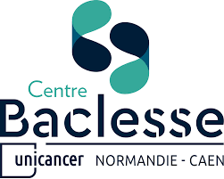
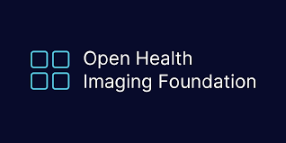

# Welcome to the SegmentationUI Back-end Project

This project aims to enable the OHIF Viewer interface to launch a deep learning algorithm designed to detect brain metastases, based on the UNETR architecture. This part of the project serves as an API to communicate between the Orthanc DICOM Web Server for retrieving/managing medical data in DICOM format and the fine-tuned UNETR deep learning model for brain metastasis segmentation.

## Important

This project is divided into two parts:
- The back-end part (this repository)
- The front-end part is accessible [here](https://github.com/VendenIX/BrainMetaSegmentatorUI-Front).

## Configuration Prerequisites to Run the Model on the Repository

| Resource               | Requirement                                             |
|------------------------|----------------------------------------------------------|
| RAM                    | 8GB VRAM                                                 |
| GPU                    | RTX 3050 Cuda                                            |


## To Install the Pre-trained Weights (required to run the deep model):

[Download the pre-trained weights](https://drive.google.com/file/d/1kR5QuRAuooYcTNLMnMj80Z9IgSs8jtLO/view)

Place this 300 MB file in **unetr/pretrained_models/**

## Install the Libraries:
/!\ Use a new environnement with python 3.9
```
conda create --name=IRM-Project python=3.9
conda activate IRM-Project
```

```bash
pip install -r requirements.txt
```
If you encounter difficulties installing, try installing the libraries incrementally. Special mention for installing PyTorch:
```bash
pip3 install torch torchvision torchaudio --index-url https://download.pytorch.org/whl/cu111
```

# Launch the Back-end in Development Mode:
## Start the Orthanc DICOM Web Server and nginx proxy:

Create a network named 'pacs' with Docker if it hasn't been created:
```bash
docker network create pacs
```

Then, start the Docker stack by navigating to the root of the repository:
```bash
docker-compose -f Orthanc/docker-compose.yml up -d
```

## Start the Flask API:
To start the API:
```bash
python3 api.py
```

# Launch the Back-end in Production Mode:
## For Windows:
Ensure that the front-end and back-end repositories are in the same directory:
```bash
git checkout deploiementWindows
```

Specify the path of the UNETR model weights in the `.env` file.
Example:
```env
MODEL_PATH='./models/checkpoint_epoch1599_val_loss0255.cpkt'
```

Execute the `start_services.bat` file:
```bash
# You can create a shortcut on your desktop or make it executable
```

Install your DICOM Web Server Orthanc here : https://www.orthanc-server.com/download-windows.php 

Adapt the path of the environnemnt in the start_services.bat file line 33 (only the path of the activate.bat file and the name of the environnment)

## If You Want to Quickly Delete Medical Data from Your Local Orthanc Server
Clean-up:
```bash
rm -rf ./Orthanc/orthanc-db/*
```

Alternatively, you can delete everything cleanly using the administration interface available at localhost:8042, or via OHIF on the front-end.

## If a Password Is Required, Use the Following:
Login: mapdr
Password: changestrongpassword

## To Shut Down the DICOM Web Server, Use the Following Command:
```bash
docker-compose -f Orthanc/docker-compose.yml down
```

And optionally, if you want to remove the pacs network:
```bash
docker network rm pacs # if you want to remove the network
```






